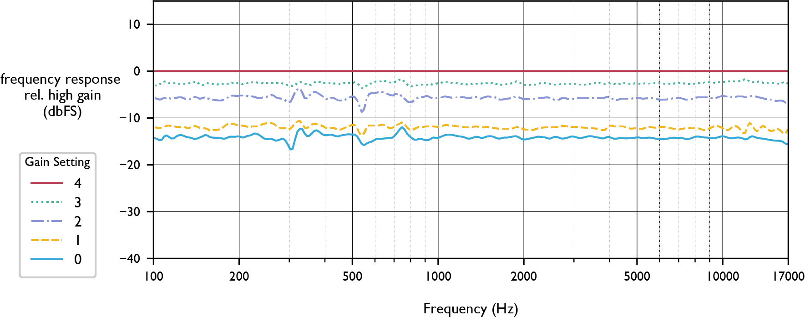

AudioMoth Performance Testing

A quantitative report of audio recording quality

January 2021

Sam Lapp

sam.lapp\@pitt.edu

*This report characterizes the audio recording performance of the
AudioMoth ARU with on- and off-axis frequency response curves and polar
sensitivity charts. Metrics are reported for recordings in free space
and in various protective housings. It includes tests from an open
grassland environment and a mixed second-growth forest and reports the
effects of strapping AudioMoths to trees of different sizes.*

Summary

The AudioMoth acoustic logger by Open Acoustic Devices has the ability
to capture accurate soundscape recordings, but adding protective
housings and placing them on trees can significantly alter the
sensitivity and frequency response. Pink noise recordings were used to
analyze the frequency-dependent sensitivity of the AudioMoth in three
housings and two environments (open grassland, forest).

The on-axis frequency response of the audiomoth without a case is mostly
flat, with a 10 dB boost above 3 kHz (blue line in plot below). Of the
three housings tested (Ziplock bag, vacuum seal bag, laser-cut case),
the vacuum sealer bag (sealed but not vacuumed) caused the least
reduction of signal, while the hard-sided laser cut case caused a
significant reduction of low-frequency content. We suspect that the loss
of low-frequency content may occur with other hard cases as well.

In an open environment, with or without housing, high-frequency sounds
(\>10 kHz) arriving from behind the device strongly are attenuated. When
the AudioMoth is deployed by strapping it on a tree, sounds arriving
from behind the device are attenuated by about 10 dB below 1 kHz and 20
dB or more above 1 kHz. Also, a notch filter occurs at a specific
frequency (about 2.3 kHz) when sound arrives from directly in front of
the device.

Protective housings and placement on trees clearly cause significant
reductions of sensitivity to certain frequencies. These effects should
be considered during the deployment of recorders and during the analysis
of recorded audio.

Table of Contents

[1.0 Introduction](#introduction) 4

[2.0 Testing Methodology](#testing-methodology) 4

> [2.1 Testing Locations](#testing-locations) 4
>
> [2.2 Variation Between AudioMoth
> Devices](#variation-between-audiomoth-devices) 5
>
> [2.3 Treatments (protective housings)](#section-1) 5
>
> [2.4 Testing Protocol](#testing-protocol) 6

[3.0 AudioMoth Gain Settings](#section-2) 8

[4.0 On-Axis Frequency Response](#on-axis-frequency-response) 9

> [4.1 AudioMoth On-Axis Frequency
> Response](#audiomoth-on-axis-frequency-response) 9
>
> [4.2 On-Axis Response in Three Protective
> Housings](#on-axis-response-in-three-protective-housings) 9

[5.0 Polar Frequency Responses](#polar-frequency-responses) 11

> [5.1 Polar Pattern of the AudioMoth in the Horizontal
> Plane](#polar-pattern-of-the-audiomoth-in-the-horizontal-plane) 11
>
> [5.2 Polar Response for Each Treatment in the Horizontal
> Plane](#section-4) 12
>
> [5.3 Polar Pattern of the AudioMoth in the Vertical
> Plane](#polar-pattern-of-the-audiomoth-in-the-vertical-plane) 14
>
> [5.4 Polar Pattern for Each Treatment in the Vertical
> Plane](#polar-pattern-for-each-treatment-in-the-vertical-plane) 15

[6.0 Acoustic Effects of Mounting AudioMoth on
Trees](#acoustic-effects-of-mounting-audiomoth-on-trees) 16

> [6.1 Frequency Response Impacts of Three
> Trees](#frequency-response-impacts-of-three-trees) 16
>
> [6.2 Frequency Response for Treatments when Mounted on
> Trees](#frequency-response-for-treatments-when-mounted-on-trees) 19

[7.0 Discussion](#discussion) 21

[References](#section-9) 22

[Appendix A: Equipment List](#appendix-a-equipment-list) 23

[Appendix B: Horizontal Rotation Response
Tables](#appendix-b-horizontal-rotation-response-tables) 24

[Appendix C: Vertical Rotation Response
Tables](#appendix-c-vertical-rotation-response-tables) 27

#  

## 1.0 Introduction

The AudioMoth is an incredible open-source Autonomous Recording Unit
(ARU) developed by Open Acoustic Devices. Its affordable price tag, low
power consumption, flexible configurability, and ability to capture a
wide frequency range are a few of the reasons it is revolutionizing the
way research is done in ecology, and probably in other fields as well.
Unfortunately, detailed and quantitative measurements of the recording
performance of the AudioMoth are currently not publicly available. A
quantitative understanding of the recording performance (for instance,
the on- and off-axis frequency response) is critical to the AudioMoth's
use as an autonomous sensing device. Therefore, I have conducted
detailed and quantitative tests in a grassland environment and a forest
to better understand the recording performance of the device, both for
the device without any housing and (as it is more commonly used) in
various protective housings.

This report is organized as follows: Section 2.0 describes the testing
methodology and reports on the variation between individual AudioMoth
devices. Section 3.0 examines the AudioMoth's five gains settings.
Section 4.0 reports the on-axis frequency response of the AudioMoth with
no housing, and with three housings (a vacuum-sealing bag, a Ziplock
bag, and a laser-cut hard case, see Figure 2). Section 5.0 reports the
polar response patterns for the horizontal and vertical planes, with and
without housings. Section 6.0 examines the effects of strapping an
AudioMoth to trees. Finally, Section7.0 offers a brief discussion of the
findings from this report.

## 2.0 Testing Methodology 

This section outlines the methodology used to test AudioMoth recording
quality. Unfortunately, the measurement of microphones does not follow
standardized procedures, which makes comparisons of performance
difficult. In this report, I follow the guidelines and recommendations
of \[1\] wherever feasible, although I could not perform all of the
recommended tests due to a lack of specialized equipment.

The use of "decibels" (dB) as a "unit" can be misleading and confusing.
In all cases, decibels refer to a logarithmic value and are reported
with respect to a reference value. The units used in this paper are
those recommended by \[1\]. For sound pressure level (a physical
measurement of sound in air), dBA is used: the "A-weighted" average of
sound pressure level across frequencies, with a reference point of 20
micro-Pascals = 0 dBA. For digital values, dBFS for "full scale" is
used: 0 dB is the highest measurement possible in the digital system. In
many cases, frequency responses are reported relative to a reference,
for instance, relative to a test microphone's frequency response. For a
more complete description of decibel units in audio, see \[2\].

#### 2.1 Testing Locations

Testing occurred in three locations:

> **Room:** Gain setting tests and comparisons of 5 caseless AudioMoths
> occurred in a 4 x 6 meter room in a residential area, with measures
> taken to reduce ambient noise levels and reflections. The ambient
> noise level was 45.5 ± 0.5 dBA.
>
> **Grassland:** The grassland environment was located at the Pymatuning
> Lab of Ecology Wood Lab site. This environment minimized reflections
> from buildings and other objects; the nearest building was over 30
> meters from the testing location and the speaker faced away from that
> building. Ambient noise levels recorded before, during, and after
> testing were 49 ± 3 dBA. There was significant wind during testing,
> which registers as low-frequency noise in recordings. For this reason,
> the frequency responses reported here may be inaccurate below 1 kHz.
> On- and off-axis tests of AudioMoth frequency response in three cases
> occurred in the grassland environment.
>
> **Forest:** The forest environment was a mixed coniferous and
> deciduous second-growth forest located at the Pymatuning Lab of
> Ecology residential site. Tests on the effects of forest reflections
> and tree obstruction occurred in the forest site. Ambient noise levels
> recorded before, during, and after testing were 47 ± 1.5 dBA.

#### 2.2 Variation Between AudioMoth Devices

AudioMoth devices appear to have consistent frequency response patterns
with minimal variation. The frequency response was measured for 5
AudioMoths, all version 1.1.0. Figure 1 shows the frequency response of
five AudioMoth devices relative to one device (ie, the frequency
response of each device is subtracted from the frequency response of
Device 1017. The maximum variation at any frequency is +4.0/-3.5 dBFS,
which is small compared to the effects considered throughout the rest of
this study.

##### Figure 1: Frequency response variation between five AudioMoth devices without cases

####  

#### 2.3 Treatments (protective housings)

This report compares three treatments (shown in Figure 2):

A.  Control: AudioMoth without any housing ("No case")

B.  Sealed (but not vacuumed) Vacuum-sealer bag ("Vacuum Bag")

C.  Zip-Lock bag ("Zip Lock")

D.  Laser-cut acrylic and neoprene case ("Laser cut case")

##### Figure 2: Housing treatments and testing environments: (A) No Case is shown in both the grassland and forest environments. Other treatments (B-D) are shown in the forest environment. 

#### 2.4 Testing Protocol

Five AudioMoths were used for testing, one for each treatment. The
individual devices did not show significant deviation in their recording
performance (Figure 1). For each treatment, the device recorded a test
playback (7 seconds of pink noise) at 30-degree increments for full
360-degree rotations in both the horizontal and vertical dimensions
(Figure 3 shows the rotation angles). I do not assume the pattern is
symmetrical because the placement of the microphone on the AudioMoth is
asymmetrical, as are the cases.

The AudioMoth Configuration App provides 5 gain settings which are
numbered 0 (low), 1, 2 (med), 3, and 4 (high). I test the frequency
response at each gain setting in Section 3.0; the gain setting is 0
("Low") for all other tests in order to maximize the signal-to-noise
ratio. The sampling rate is always 48 kHz.

The pink noise test signal was generated with a Mackie SRM-450
loudspeaker at a level of 86 dBA at the receiver (See Appendix A for a
complete list of equipment). The receiver was spaced 1 meter from the
speaker, except where noted. The frequency response of the loudspeaker,
as recorded by a dbx RTA-M reference microphone, is shown in Figure 4.
The frequencies roll off dramatically above 17 kHz (the speaker is
unable to produce higher frequencies). Therefore, in this report, all
frequency responses and analyses use a frequency range of 100 Hz to 17
kHz. This range covers the vocalizing range of all birds and frogs and
some insects, but not bats (Figure 5 shows typical vocalizing ranges for
four groups). Plots of frequency response always show frequency on the
x-axis on a logarithmic scale from 100 Hz to 17 kHz and decibels (dB) on
the y-axis with a range of 55 dB so that figures can be compared easily.

For comparison of the test signal with realistic field data, Figure 6
shows the average frequency spectrum from a one-hour recording taken by
an AudioMoth at Powdermill Nature Reserve in late April 2020 during a
dawn chorus.

##### Figure 3: Illustration of horizontal and vertical rotation measurements

##### Figure 4: Pink noise generated by Mackie SRM-450 and recorded by dbx RTA-M test microphone (before and after calibration) in the grassland environment, relative to the level at 1 kHz = 0dB

##### Figure 5: Typical vocalizing frequency ranges of anurans (frogs and toads), birds, orthoptera (grasshoppers, crickets, and relatives), and bats; based on \[3-6\]

##### Figure 6: Average frequency spectrum over a one-hour field recording of a dawn chorus at Powdermill Nature Reserve in Pennsylvania, in late April 2018 (5:30 to 6:30 AM). 

##  

## 3.0 AudioMoth Gain Settings

The AudioMoth has five gain settings, numbered from 0 to 4. Figure 7
plots the frequency response of one device set to each gain setting,
relative to the highest gain setting (4). For this test, pink noise was
played at 69 dBA to avoid clipping on the highest gain setting. As seen
in Figure 7, the gain settings do not significantly affect the frequency
response. The average level for gain settings 0, 1, 2, and 3 relative to
gain setting 4 are -14.2, -12.0, -5.7, and -2.6 dB, respectively. The
gain settings of the AudioMoth can be chosen based on the environment,
study, and protective housing used. However, this adjustability is
limited by the 14 dB range from the lowest to highest gain settings.

##### Figure 7: Frequency response for pink noise recorded at the 5 gain settings, relative to the highest gain setting

##  

## 4.0 On-Axis Frequency Response 

I recorded on-axis responses and polar responses (both horizontal and
vertical rotation) for each treatment in the grassland environment to
minimize reflections. There was significant wind during the testing
which may have caused error in the frequency response measurements,
especially in low frequencies (\<1000 Hz).

#### 4.1 AudioMoth On-Axis Frequency Response

Figure 8 shows the frequency response of an AudioMoth without any
housing, relative to 1 kHz = 0dB. This is the typical "frequency
response" reported by a microphone manufacturer. It was produced by
playing pink noise in the grassland environment and subtracting the
spectrum of the test microphone recording the same signal. The AudioMoth
has a flat frequency response below 2 kHz, with a significant increase
in sensitivity (about 7 dB) in higher frequencies.

##### Figure 8: Typical on-axis frequency response of the AudioMoth

#### 4.2 On-Axis Response in Three Protective Housings

Figure 9 shows the same frequency response as above, with the AudioMoth
in various protective housings. The dB reference for all lines in this
plot is the level of the control (No Case) at 1 kHz. Table 1 reports
selected values from this plot. In order to isolate the effects of
treatments relative to the control, Figure 10 shows each spectrum
subtracted from the control (AudioMoth with no case). Additionally, the
box plots in Figure 11 illustrate the mean and variation of the
frequency response sampled at logarithmically spaced intervals from 100
to 17 kHz.

From these figures, it is clear that the Zip Lock and Vacuum Bag have
the least impact on the sound that the AudioMoth records. To summarize
the effects of each treatment:

> B: **The Vacuum Bag** has the least effect, with the only significant
> impact being a 5-10 dB loss above 10 kHz. The frequency response is
> mostly flat but has sharp dips at around 12 kHz and 15 kHz.
>
> C: **The Zip Lock Bag** has slight losses overall, with a bump from
> 5-10 kHz and a dropoff above 10 kHz.
>
> D: **The Laser Cut Case** dramatically reduces low frequencies (\<1500
> Hz) by over 20 dB, and reduces high frequencies by about 10 dB, with a
> steep dropoff above 13 kHz

##### Figure 9: On-axis Frequency Response of AudioMoth for each treatment

##### Table 1: On-axis frequency response of each treatment, dB relative to "A: No Case" at 1 kHz = 0 dB

  Treatment           100 Hz   200 Hz   500 Hz   1 kHz   2 kHz   5 kHz   10 kHz   15 kHz
  ------------------- -------- -------- -------- ------- ------- ------- -------- --------
  A: No Case          -3       0        0        0       2       7       5        8
  B: Vacuum Bag       -6       -1       0        1       1       5       2        -4
  C: Zip Lock         0        -4       -3       -4      -1      9       2        -15
  D: Laser Cut Case   -28      -24      -23      -17     -1      -1      -7       -9

##### Figure 10: Net effect of each treatment: on-axis frequency response for each treatment subtracted from the frequency response of the control (No Case)

##### Figure 11: Box plots summarizing the frequency response for each treatment at logarithmically spaced frequencies between 100 Hz and 17 kHz 

## 5.0 Polar Frequency Responses

A polar pattern describes the sensitivity of a microphone when the
source is located at different angles from the microphone (for instance,
in front, behind, or to the side). The AudioMoth is designed as an
omnidirectional microphone, meaning that it has equal sensitivity to
sound arriving from any direction. Practically, this will not hold true,
especially for high frequencies, because the device will reflect or
absorb some sounds that do not arrive from the front.

By incrementally rotating the microphone 360 degrees in the horizontal
or vertical plane (Figure 3), and keeping the source at a fixed
position, we can test the polar pattern at various frequencies. These
polar patterns were recorded in the grassland environment (see Testing
Methodology) to minimize reflections. There was significant wind during
the testing which could be a source of error in the frequency response,
especially in low frequencies (\<1000 Hz).

#### 5.1 Polar Pattern of the AudioMoth in the Horizontal Plane

Figure 12 shows the polar response of the AudioMoth (No Case) for
several frequencies. Each frequency is plotted in 30-degree increments,
relative to that frequency's level at 0 degrees (on-axis). Lines that
dip towards the center of the plot indicate a reduction of sensitivity
to that frequency. The polar response is relatively omnidirectional for
low frequencies, losing about 5 dB for off-axis sounds. This is expected
because sound waves below 2 kHz have wavelengths significantly longer
than the dimensions of the device (a 2 kHz sound wave is approximately
17 cm).

Higher frequencies show significant attenuation directly behind the mic,
especially at 5 kHz (over 25 dB reduction). Figure 13 shows the
frequency response without a case from the front, back, and sides. The
most significant effects are losses of 28 dB at 5 kHz and 20 dB at 10
kHz when sound arrives from behind the device.

##### Figure 12: Horizontal polar response of the AudioMoth (No Case) at several frequencies (90 degrees is to the left and 270 degrees is to the right of the device)

##### Figure 13: Frequency Response of the AudioMoth (No Case) from the front, back (180 degrees), and sides

####  

#### 5.2 Polar Response for Each Treatment in the Horizontal Plane

Figure 14 shows the polar response in the horizontal plane for each
treatment at five frequencies. Surprisingly, the Zip Lock Bag and Vacuum
Bag amplify high frequencies (15 kHz) arriving from the sides. The Laser
Cut Case causes reductions of 5-10 dB for lower frequencies. Appendix B
reports numerical values from these tests.

##### Figure 14: Horizontal-plane polar responses for each treatment (90 degrees is to the left and 270 degrees is to the right of the device) 

#### 5.3 Polar Pattern of the AudioMoth in the Vertical Plane

These tests are the same as the horizontal-plane tests, except that the
device is rotated such that sound arrives from "above" or "below"
instead of from the left or right (see Figure 3, "vertical rotation").
Vertical rotation of the AudioMoth (Figure 15) has little effect on low
frequencies other than a surprising boost of 500 Hz arriving from
slightly below the device. This is likely due to a resonance mode in the
device or a measurement error. In the high frequencies, 15 kHz is
severely reduced when it arrives from behind and slightly above the
device. This may be a result of cancellation or absorption by the
battery pack (15 kHz has a wavelength of about 2 cm).

##### Figure 15: Vertical polar response of the AudioMoth (No Case) at several frequencies (90 degrees is above and 270 degrees is below the device)

####  

#### 5.4 Polar Pattern for Each Treatment in the Vertical Plane

Figure 16 shows the effects of vertical rotation in each treatment at
several frequencies. Each frequency is plotted relative to that
frequency's on-axis level. Treatment B (Vacuum Bag) is missing due to an
error during measurement. Appendix C reports numerical values from these
tests.

##### Figure 16: Polar frequency response for vertical-plane rotation for each treatment (90 degrees is above and 270 degrees is below the device) (Treatment B is missing due to an error during measurement) 

## 6.0 Acoustic Effects of Mounting AudioMoth on Trees

In practical use, AudioMoths are often deployed by strapping them to
trees. This section attempts to quantify the impact of this deployment
strategy on the frequency response of the device. AudioMoths were
strapped to the front, back, and sides of trees from the perspective of
the sound source.

#### 6.1 Frequency Response Impacts of Three Trees

Figure 17 shows the spectrums of pink noise recorded by a test
microphone in front of and behind trees of three circumferences. Each
spectrum is plotted relative to the level at 1 kHz in the front of that
tree. Each spectrum in front of a tree shows at least one strong notch
filter (for instance 5.5 kHz in Figure 17-A) where cancellation occurred
as sound reflected off of the tree and back to the microphone. Besides
these notch filters, the pink noise behind the tree is consistently
quieter than in the front. The 41 cm and 97 cm diameter trees have
similar effects, reducing frequencies under 2 kHz by about 10 dB, a
reduction that increases to 20 dB in higher frequencies. The 170 cm
circumference tree blocks more sound, reducing low frequencies by about
20 dB and high frequencies by over 25 dB.

Figure 18 shows the pink noise spectrums of an AudioMoth (No Case)
strapped to the front, back, or side of each tree from the perspective
of the sound source. When the AudioMoth is on the same side as the tree
as the sound source (0 degrees), a narrow notch filter appears at 2.3
kHz, indicating cancellation of 15 cm sound waves. One possible cause of
this is a reflection of incoming sound off of the cambium of the tree:
if sound travels 3.75 cm to the reflective surface and 3.75 cm back to
the receiver, it would travel half a wavelength (7.5 cm) round trip and
cause destructive interference of 2.3 kHz sound at the microphone.
Interestingly, if this is true, this "dead spot" will only have a strong
effect directly in front of the microphone and at a specific frequency.

Besides the dramatic notch filters, the effects of the 97 cm and 170 cm
circumference tree on the frequency response are similar to the expected
responses based on Figure 17. The 41 cm circumference tree caused only
minor reductions in low frequencies.

##### Figure 17: Pink noise in front of and behind trees of circumference 41 (A), 97 (B), and 170 cm (C), recorded by test mic

##### Figure 18: Pink noise recorded by moth on the front (0 degrees), back (180 degrees), and sides of trees of circumference 41 (A), 97 (B), and 170 cm (C)

####  

#### 6.2 Frequency Response for Treatments when Mounted on Trees

Figure 19 shows tests from each treatment strapped to a 97 cm
circumference tree at chest level. Each figure shows frequency response
when the device is placed on the front (0 degrees), back (180 degrees),
and sides of the tree from the perspective of the sound source.
Responses are plotted relative to the level of on-axis 1 kHz for each
treatment.

In general, frequency responses were much less flat in these tests.
Reflections off of the tree to which the device is strapped (and other
trees) cause constructive and destructive interference, leading to local
peaks and troughs in the frequency response. However, the general trends
are consistent: behind the tree, high frequencies are reduced more than
low frequencies, with reductions of approximately 10 dB at the
low-frequency end and 20 dB at the high-frequency end.

##### Figure 19: Effect of sound arriving from different angles when AudioMoth is mounted on a tree, for 4 treatments

#  

## 7.0 Discussion

In practice, the AudioMoth is rarely used without protective housing and
is often strapped to a tree. When planning deployments of AudioMoths for
data collection, the effects of such choices on the recorded audio
should not be ignored. If a deployment strategy will cause significant
reductions in certain frequency bands, the downstream effects of this
lost information should be carefully considered. For instance, strapping
an audio moth to a medium-sized tree will result in a sensitivity to
high frequencies that is about 25 decibels higher in front of the device
than behind the device. Considering that sound decays approximately 6 dB
per doubling of distance ignoring absorption and attenuation, the
maximum recording distance of an event behind the device would
effectively be four times smaller than the front. Even when the
AudioMoth is not in a case and not strapped to a tree, it is not truly
"omnidirectional". When sound arrives from behind the microphone, there
is an overall reduction of at least 5 dB for all frequencies, and
certain frequencies (around 5 kHz and 10 kHz) are sharply reduced.

A reduction of level in a frequency response plot can be thought of as a
loss of information for each frequency. While an overall loss of level
simply results in quieter files (and effectively a smaller sampling
radius), the loss of specific frequencies more than others "distorts" or
"biases" the data by recording some sounds quieter than others of
equivalent real-world volume. This would be problematic if, for
instance, an ecologist were comparing the presence of two species with
vocalizations in two specific frequency ranges, one of which happens to
be recorded with 15 dB less sensitivity than the other. During analysis,
it is important to account for any frequency-dependent sensitivity of
the deployment strategy.

When recording ultrasonic vocalizations (\> 20 kHz) such as those of
bats or insects, special attention should be given to any protective
housing. Though this report does not test the effects of housings on
ultrasonic frequencies, it is likely that high frequencies will be
strongly attenuated by solid cases. The "quarter wavelength rule" of
sound attenuation is a useful heuristic: a physical barrier
significantly absorbs frequencies for which its thickness is least a
quarter wavelength. For instance, a 20 kHz sound wave has a wavelength
of about 17 mm, so a barrier 4.3 mm thick will significantly attenuate
this frequency.

Broadly speaking, the results of this report can be summarized as
follows:

1.  AudioMoth devices from the same production batch have consistent
    > frequency responses

2.  The AudioMoth gain settings give a 14 dB adjustment range

3.  A hard case (but not a bag) can significantly reduce low- and
    > mid-frequency content from all directions

4.  With or without housing, high-frequency sounds (\>10 kHz) arriving
    > from behind the device are attenuated

5.  Strapped to a tree, a notch filter occurs at a specific frequency
    > (about 2.3 kHz) directly in front of the device

6.  Strapped to a tree, sound arriving from behind is attenuated 10 dB
    > below 2 kHz and 20 dB above 2 kHz

7.  Of the housings tested, the Vacuum Bag caused the least loss and had
    > the flattest response

##  

## References

\[1\] Eargle, John. "Microphone Measurements, Standards, and
Specifications". The Microphone Book: From mono to stereo to surround: a
guide to microphone design and application. CRC Press, 2012. 129-143.

\[2\] "Decibels". DSPRelated.com.
[[https://www.dsprelated.com/freebooks/mdft/Decibels.html]{.ul}](https://www.dsprelated.com/freebooks/mdft/Decibels.html).
Accessed June 23, 2020.

\[3\] Dooling R.J. (1980) Behavior and Psychophysics of Hearing in
Birds. In: Popper A.N., Fay R.R. (eds) Comparative Studies of Hearing in
Vertebrates. Proceedings in Life Sciences. Springer, New York, NY

\[4\] "Bat Echolocation". Maryland Department of Natural Resources.
[[https://dnr.maryland.gov/wildlife/Pages/plants_wildlife/bats/batelocu.aspx\#:\~:text=Most%20bat%20echolocation%20occurs%20beyond,bat%20sounds%20humans%20can%20hear]{.ul}](https://dnr.maryland.gov/wildlife/Pages/plants_wildlife/bats/batelocu.aspx#:~:text=Most%20bat%20echolocation%20occurs%20beyond,bat%20sounds%20humans%20can%20hear).
Accessed June 23, 2020.

\[5\] Arch, Victoria. Acoustic Communication Systems of "Ultrasonic"
Frogs.
[[https://www.ioes.ucla.edu/wp-content/uploads/Arch_FieldReport-FIN.pdf]{.ul}](https://www.ioes.ucla.edu/wp-content/uploads/Arch_FieldReport-FIN.pdf).
Accessed June 23, 2020.

\[6\] Sarria-S FA, Morris GK, Windmill JFC, Jackson J, Montealegre-Z F
(2014) Shrinking Wings for Ultrasonic Pitch Production: Hyperintense
Ultra-Short-Wavelength Calls in a New Genus of Neotropical Katydids
(Orthoptera: Tettigoniidae). PLoS ONE 9(6): e98708.
[[https://doi.org/10.1371/journal.pone.0098708]{.ul}](https://doi.org/10.1371/journal.pone.0098708)

## Appendix A: Equipment List

The following hardware was used during testing:

Enviro meters EM80 Sound Level Meter (A-weighted)

AudioMoth version 1.1.0 (5 units with batteries)

dbx RTA-M Reference Microphone

Focusrite Scarlett 2i2 Audio Interface

Macbook Pro 2013 with Logic Pro X and Audacity 2.2.2

Mackie SRM-450 Loudspeaker

##  

## Appendix B: Horizontal Rotation Response Tables

These tables show the level in dB relative to the on-axis level at 1 kHz
of the frequency response in each treatment for horizontal rotation. See
Section 5.2 for discussion.

<table>
<thead>
<tr class="header">
<th>A: No Case</th>
<th>
Rotation

(degrees)
</th>
<th>100 Hz</th>
<th>200 Hz</th>
<th>500 Hz</th>
<th>1 kHz</th>
<th>2 kHz</th>
<th>5 kHz</th>
<th>10 kHz</th>
<th>17 kHz</th>
</tr>
</thead>
<tbody>
<tr class="odd">
<td></td>
<td>0</td>
<td>1</td>
<td>2</td>
<td>2</td>
<td>0</td>
<td>1</td>
<td>4</td>
<td>2</td>
<td>9</td>
</tr>
<tr class="even">
<td></td>
<td>30</td>
<td>-1</td>
<td>0</td>
<td>-1</td>
<td>-2</td>
<td>0</td>
<td>3</td>
<td>1</td>
<td>7</td>
</tr>
<tr class="odd">
<td></td>
<td>60</td>
<td>0</td>
<td>2</td>
<td>0</td>
<td>-1</td>
<td>0</td>
<td>3</td>
<td>0</td>
<td>4</td>
</tr>
<tr class="even">
<td></td>
<td>90</td>
<td>0</td>
<td>0</td>
<td>-2</td>
<td>-3</td>
<td>-2</td>
<td>2</td>
<td>-1</td>
<td>4</td>
</tr>
<tr class="odd">
<td></td>
<td>120</td>
<td>-7</td>
<td>-4</td>
<td>-3</td>
<td>-4</td>
<td>-5</td>
<td>-2</td>
<td>-5</td>
<td>4</td>
</tr>
<tr class="even">
<td></td>
<td>150</td>
<td>-6</td>
<td>-2</td>
<td>-2</td>
<td>-4</td>
<td>-5</td>
<td>-5</td>
<td>-7</td>
<td>3</td>
</tr>
<tr class="odd">
<td></td>
<td>180</td>
<td>-8</td>
<td>-5</td>
<td>-3</td>
<td>-3</td>
<td>-4</td>
<td>-21</td>
<td>-13</td>
<td>-5</td>
</tr>
<tr class="even">
<td></td>
<td>210</td>
<td>-7</td>
<td>-5</td>
<td>-3</td>
<td>-3</td>
<td>-3</td>
<td>0</td>
<td>-8</td>
<td>2</td>
</tr>
<tr class="odd">
<td></td>
<td>240</td>
<td>-6</td>
<td>-3</td>
<td>-3</td>
<td>-3</td>
<td>-3</td>
<td>-1</td>
<td>-4</td>
<td>-8</td>
</tr>
<tr class="even">
<td></td>
<td>270</td>
<td>-9</td>
<td>-5</td>
<td>-3</td>
<td>-3</td>
<td>-3</td>
<td>-2</td>
<td>-1</td>
<td>2</td>
</tr>
<tr class="odd">
<td></td>
<td>300</td>
<td>-6</td>
<td>-4</td>
<td>-3</td>
<td>-3</td>
<td>-2</td>
<td>3</td>
<td>3</td>
<td>9</td>
</tr>
<tr class="even">
<td></td>
<td>330</td>
<td>-9</td>
<td>-5</td>
<td>-3</td>
<td>-2</td>
<td>0</td>
<td>6</td>
<td>3</td>
<td>11</td>
</tr>
</tbody>
</table>

<table>
<thead>
<tr class="header">
<th>B: Vacuum Bag</th>
<th>
Rotation

(degrees)
</th>
<th>100 Hz</th>
<th>200 Hz</th>
<th>500 Hz</th>
<th>1 kHz</th>
<th>2 kHz</th>
<th>5 kHz</th>
<th>10 kHz</th>
<th>17 kHz</th>
</tr>
</thead>
<tbody>
<tr class="odd">
<td></td>
<td>0</td>
<td>-4</td>
<td>-2</td>
<td>-2</td>
<td>0</td>
<td>-1</td>
<td>2</td>
<td>0</td>
<td>3</td>
</tr>
<tr class="even">
<td></td>
<td>30</td>
<td>-7</td>
<td>-2</td>
<td>-2</td>
<td>0</td>
<td>2</td>
<td>4</td>
<td>-3</td>
<td>5</td>
</tr>
<tr class="odd">
<td></td>
<td>60</td>
<td>-7</td>
<td>-3</td>
<td>-2</td>
<td>-1</td>
<td>0</td>
<td>1</td>
<td>-6</td>
<td>4</td>
</tr>
<tr class="even">
<td></td>
<td>90</td>
<td>0</td>
<td>-1</td>
<td>-2</td>
<td>-3</td>
<td>-10</td>
<td>-2</td>
<td>-9</td>
<td>-5</td>
</tr>
<tr class="odd">
<td></td>
<td>120</td>
<td>-3</td>
<td>-1</td>
<td>-1</td>
<td>-3</td>
<td>0</td>
<td>-3</td>
<td>-9</td>
<td>-2</td>
</tr>
<tr class="even">
<td></td>
<td>150</td>
<td>0</td>
<td>-1</td>
<td>-1</td>
<td>-1</td>
<td>-10</td>
<td>-10</td>
<td>-3</td>
<td>-5</td>
</tr>
<tr class="odd">
<td></td>
<td>180</td>
<td>0</td>
<td>-2</td>
<td>0</td>
<td>1</td>
<td>5</td>
<td>-5</td>
<td>-11</td>
<td>-13</td>
</tr>
<tr class="even">
<td></td>
<td>210</td>
<td>-4</td>
<td>-2</td>
<td>0</td>
<td>2</td>
<td>8</td>
<td>-5</td>
<td>0</td>
<td>4</td>
</tr>
<tr class="odd">
<td></td>
<td>240</td>
<td>-3</td>
<td>-2</td>
<td>0</td>
<td>2</td>
<td>3</td>
<td>-12</td>
<td>-11</td>
<td>0</td>
</tr>
<tr class="even">
<td></td>
<td>270</td>
<td>0</td>
<td>-2</td>
<td>0</td>
<td>1</td>
<td>2</td>
<td>-9</td>
<td>1</td>
<td>6</td>
</tr>
<tr class="odd">
<td></td>
<td>300</td>
<td>0</td>
<td>-3</td>
<td>-1</td>
<td>0</td>
<td>5</td>
<td>-1</td>
<td>-1</td>
<td>9</td>
</tr>
<tr class="even">
<td></td>
<td>330</td>
<td>-8</td>
<td>-3</td>
<td>-2</td>
<td>0</td>
<td>-2</td>
<td>2</td>
<td>4</td>
<td>2</td>
</tr>
</tbody>
</table>

<table>
<thead>
<tr class="header">
<th>C: Zip Lock</th>
<th>
Rotation

(degrees)
</th>
<th>100 Hz</th>
<th>200 Hz</th>
<th>500 Hz</th>
<th>1 kHz</th>
<th>2 kHz</th>
<th>5 kHz</th>
<th>10 kHz</th>
<th>17 kHz</th>
</tr>
</thead>
<tbody>
<tr class="odd">
<td></td>
<td>0</td>
<td>-2</td>
<td>-1</td>
<td>0</td>
<td>0</td>
<td>4</td>
<td>13</td>
<td>8</td>
<td>-7</td>
</tr>
<tr class="even">
<td></td>
<td>30</td>
<td>-7</td>
<td>-1</td>
<td>0</td>
<td>0</td>
<td>4</td>
<td>11</td>
<td>10</td>
<td>5</td>
</tr>
<tr class="odd">
<td></td>
<td>60</td>
<td>-6</td>
<td>-1</td>
<td>0</td>
<td>-3</td>
<td>3</td>
<td>12</td>
<td>8</td>
<td>7</td>
</tr>
<tr class="even">
<td></td>
<td>90</td>
<td>-4</td>
<td>-1</td>
<td>0</td>
<td>-5</td>
<td>0</td>
<td>8</td>
<td>6</td>
<td>1</td>
</tr>
<tr class="odd">
<td></td>
<td>120</td>
<td>-2</td>
<td>-1</td>
<td>0</td>
<td>-5</td>
<td>-1</td>
<td>3</td>
<td>0</td>
<td>0</td>
</tr>
<tr class="even">
<td></td>
<td>150</td>
<td>-4</td>
<td>-1</td>
<td>0</td>
<td>-1</td>
<td>2</td>
<td>-8</td>
<td>-3</td>
<td>-2</td>
</tr>
<tr class="odd">
<td></td>
<td>180</td>
<td>-2</td>
<td>0</td>
<td>0</td>
<td>1</td>
<td>5</td>
<td>0</td>
<td>-3</td>
<td>-2</td>
</tr>
<tr class="even">
<td></td>
<td>210</td>
<td>-4</td>
<td>0</td>
<td>0</td>
<td>3</td>
<td>5</td>
<td>3</td>
<td>4</td>
<td>-8</td>
</tr>
<tr class="odd">
<td></td>
<td>240</td>
<td>0</td>
<td>0</td>
<td>0</td>
<td>3</td>
<td>1</td>
<td>2</td>
<td>0</td>
<td>5</td>
</tr>
<tr class="even">
<td></td>
<td>270</td>
<td>5</td>
<td>0</td>
<td>0</td>
<td>2</td>
<td>0</td>
<td>4</td>
<td>5</td>
<td>11</td>
</tr>
<tr class="odd">
<td></td>
<td>300</td>
<td>-7</td>
<td>0</td>
<td>0</td>
<td>1</td>
<td>1</td>
<td>9</td>
<td>14</td>
<td>14</td>
</tr>
<tr class="even">
<td></td>
<td>330</td>
<td>-1</td>
<td>0</td>
<td>0</td>
<td>0</td>
<td>2</td>
<td>11</td>
<td>17</td>
<td>1</td>
</tr>
</tbody>
</table>

<table>
<thead>
<tr class="header">
<th>D: Laser Cut Case</th>
<th>
Rotation

(degrees)
</th>
<th>100 Hz</th>
<th>200 Hz</th>
<th>500 Hz</th>
<th>1 kHz</th>
<th>2 kHz</th>
<th>5 kHz</th>
<th>10 kHz</th>
<th>17 kHz</th>
</tr>
</thead>
<tbody>
<tr class="odd">
<td></td>
<td>0</td>
<td>-8</td>
<td>-7</td>
<td>-8</td>
<td>0</td>
<td>6</td>
<td>6</td>
<td>5</td>
<td>0</td>
</tr>
<tr class="even">
<td></td>
<td>30</td>
<td>-6</td>
<td>-7</td>
<td>-10</td>
<td>8</td>
<td>7</td>
<td>7</td>
<td>6</td>
<td>3</td>
</tr>
<tr class="odd">
<td></td>
<td>60</td>
<td>-10</td>
<td>-7</td>
<td>-9</td>
<td>-1</td>
<td>3</td>
<td>5</td>
<td>2</td>
<td>3</td>
</tr>
<tr class="even">
<td></td>
<td>90</td>
<td>-17</td>
<td>-12</td>
<td>-11</td>
<td>-4</td>
<td>5</td>
<td>1</td>
<td>0</td>
<td>-7</td>
</tr>
<tr class="odd">
<td></td>
<td>120</td>
<td>-17</td>
<td>-13</td>
<td>-12</td>
<td>-6</td>
<td>4</td>
<td>-3</td>
<td>-5</td>
<td>-12</td>
</tr>
<tr class="even">
<td></td>
<td>150</td>
<td>-18</td>
<td>-13</td>
<td>-12</td>
<td>-6</td>
<td>-2</td>
<td>-1</td>
<td>-4</td>
<td>-13</td>
</tr>
<tr class="odd">
<td></td>
<td>180</td>
<td>-18</td>
<td>-13</td>
<td>-12</td>
<td>-7</td>
<td>-3</td>
<td>-7</td>
<td>-14</td>
<td>-16</td>
</tr>
<tr class="even">
<td></td>
<td>210</td>
<td>-17</td>
<td>-13</td>
<td>-11</td>
<td>-7</td>
<td>5</td>
<td>2</td>
<td>-5</td>
<td>-7</td>
</tr>
<tr class="odd">
<td></td>
<td>240</td>
<td>-17</td>
<td>-12</td>
<td>-11</td>
<td>-6</td>
<td>3</td>
<td>1</td>
<td>-6</td>
<td>-11</td>
</tr>
<tr class="even">
<td></td>
<td>270</td>
<td>-17</td>
<td>-12</td>
<td>-11</td>
<td>-5</td>
<td>2</td>
<td>1</td>
<td>-2</td>
<td>-5</td>
</tr>
<tr class="odd">
<td></td>
<td>300</td>
<td>-17</td>
<td>-13</td>
<td>-11</td>
<td>-5</td>
<td>0</td>
<td>6</td>
<td>2</td>
<td>-2</td>
</tr>
<tr class="even">
<td></td>
<td>330</td>
<td>-18</td>
<td>-13</td>
<td>-12</td>
<td>-5</td>
<td>-5</td>
<td>4</td>
<td>0</td>
<td>2</td>
</tr>
</tbody>
</table>

##  

## Appendix C: Vertical Rotation Response Tables

These tables show the level in dB relative to the on-axis level at 1 kHz
of the frequency response in treatments A, C, D, and E for vertical
rotation (B is missing due to an error during measurement). See Section
5.4 for discussion.

<table>
<thead>
<tr class="header">
<th>A: No Case</th>
<th>
Rotation

(degrees)
</th>
<th>100 Hz</th>
<th>200 Hz</th>
<th>500 Hz</th>
<th>1 kHz</th>
<th>2 kHz</th>
<th>5 kHz</th>
<th>10 kHz</th>
<th>17 kHz</th>
</tr>
</thead>
<tbody>
<tr class="odd">
<td></td>
<td>0</td>
<td>-5</td>
<td>-1</td>
<td>0</td>
<td>0</td>
<td>2</td>
<td>7</td>
<td>3</td>
<td>10</td>
</tr>
<tr class="even">
<td></td>
<td>30</td>
<td>-1</td>
<td>0</td>
<td>0</td>
<td>0</td>
<td>2</td>
<td>8</td>
<td>4</td>
<td>11</td>
</tr>
<tr class="odd">
<td></td>
<td>60</td>
<td>-4</td>
<td>-1</td>
<td>-1</td>
<td>-1</td>
<td>0</td>
<td>6</td>
<td>5</td>
<td>13</td>
</tr>
<tr class="even">
<td></td>
<td>90</td>
<td>-6</td>
<td>-2</td>
<td>-1</td>
<td>-1</td>
<td>-1</td>
<td>0</td>
<td>1</td>
<td>5</td>
</tr>
<tr class="odd">
<td></td>
<td>120</td>
<td>-7</td>
<td>-2</td>
<td>-1</td>
<td>-1</td>
<td>-1</td>
<td>-1</td>
<td>-2</td>
<td>-3</td>
</tr>
<tr class="even">
<td></td>
<td>150</td>
<td>-6</td>
<td>-1</td>
<td>-1</td>
<td>-1</td>
<td>-1</td>
<td>0</td>
<td>-10</td>
<td>-12</td>
</tr>
<tr class="odd">
<td></td>
<td>180</td>
<td>-6</td>
<td>-2</td>
<td>-1</td>
<td>-1</td>
<td>-2</td>
<td>-17</td>
<td>-4</td>
<td>4</td>
</tr>
<tr class="even">
<td></td>
<td>210</td>
<td>3</td>
<td>3</td>
<td>2</td>
<td>0</td>
<td>-3</td>
<td>-1</td>
<td>-1</td>
<td>6</td>
</tr>
<tr class="odd">
<td></td>
<td>240</td>
<td>-1</td>
<td>-1</td>
<td>-1</td>
<td>-1</td>
<td>-2</td>
<td>1</td>
<td>-2</td>
<td>7</td>
</tr>
<tr class="even">
<td></td>
<td>270</td>
<td>-7</td>
<td>-2</td>
<td>-1</td>
<td>-1</td>
<td>0</td>
<td>3</td>
<td>2</td>
<td>6</td>
</tr>
<tr class="odd">
<td></td>
<td>300</td>
<td>-4</td>
<td>-2</td>
<td>0</td>
<td>0</td>
<td>1</td>
<td>4</td>
<td>4</td>
<td>6</td>
</tr>
<tr class="even">
<td></td>
<td>330</td>
<td>0</td>
<td>3</td>
<td>8</td>
<td>5</td>
<td>4</td>
<td>5</td>
<td>2</td>
<td>9</td>
</tr>
</tbody>
</table>

<table>
<thead>
<tr class="header">
<th>C: Zip Lock</th>
<th>
Rotation

(degrees)
</th>
<th>100 Hz</th>
<th>200 Hz</th>
<th>500 Hz</th>
<th>1 kHz</th>
<th>2 kHz</th>
<th>5 kHz</th>
<th>10 kHz</th>
<th>17 kHz</th>
</tr>
</thead>
<tbody>
<tr class="odd">
<td></td>
<td>0</td>
<td>-8</td>
<td>-2</td>
<td>0</td>
<td>0</td>
<td>1</td>
<td>5</td>
<td>4</td>
<td>1</td>
</tr>
<tr class="even">
<td></td>
<td>30</td>
<td>-9</td>
<td>-2</td>
<td>0</td>
<td>1</td>
<td>0</td>
<td>4</td>
<td>7</td>
<td>0</td>
</tr>
<tr class="odd">
<td></td>
<td>60</td>
<td>-9</td>
<td>-2</td>
<td>0</td>
<td>1</td>
<td>-1</td>
<td>2</td>
<td>7</td>
<td>-7</td>
</tr>
<tr class="even">
<td></td>
<td>90</td>
<td>-4</td>
<td>-2</td>
<td>0</td>
<td>2</td>
<td>-2</td>
<td>0</td>
<td>4</td>
<td>-7</td>
</tr>
<tr class="odd">
<td></td>
<td>120</td>
<td>-7</td>
<td>-2</td>
<td>0</td>
<td>2</td>
<td>2</td>
<td>-5</td>
<td>0</td>
<td>-6</td>
</tr>
<tr class="even">
<td></td>
<td>150</td>
<td>-7</td>
<td>-2</td>
<td>0</td>
<td>1</td>
<td>5</td>
<td>0</td>
<td>-9</td>
<td>-8</td>
</tr>
<tr class="odd">
<td></td>
<td>180</td>
<td>-5</td>
<td>-2</td>
<td>-1</td>
<td>-1</td>
<td>4</td>
<td>-8</td>
<td>-1</td>
<td>-16</td>
</tr>
<tr class="even">
<td></td>
<td>210</td>
<td>-5</td>
<td>-3</td>
<td>-2</td>
<td>-5</td>
<td>0</td>
<td>0</td>
<td>0</td>
<td>-2</td>
</tr>
<tr class="odd">
<td></td>
<td>240</td>
<td>-6</td>
<td>-3</td>
<td>-5</td>
<td>-10</td>
<td>-1</td>
<td>2</td>
<td>3</td>
<td>0</td>
</tr>
<tr class="even">
<td></td>
<td>270</td>
<td>-7</td>
<td>-3</td>
<td>-5</td>
<td>-7</td>
<td>1</td>
<td>4</td>
<td>-1</td>
<td>2</td>
</tr>
<tr class="odd">
<td></td>
<td>300</td>
<td>-6</td>
<td>-3</td>
<td>-4</td>
<td>-4</td>
<td>1</td>
<td>5</td>
<td>-2</td>
<td>6</td>
</tr>
<tr class="even">
<td></td>
<td>330</td>
<td>-7</td>
<td>-2</td>
<td>-3</td>
<td>-1</td>
<td>1</td>
<td>6</td>
<td>2</td>
<td>2</td>
</tr>
</tbody>
</table>

<table>
<thead>
<tr class="header">
<th>D: Laser Cut Case</th>
<th>
Rotation

(degrees)
</th>
<th>100 Hz</th>
<th>200 Hz</th>
<th>500 Hz</th>
<th>1 kHz</th>
<th>2 kHz</th>
<th>5 kHz</th>
<th>10 kHz</th>
<th>17 kHz</th>
</tr>
</thead>
<tbody>
<tr class="odd">
<td></td>
<td>0</td>
<td>-12</td>
<td>-7</td>
<td>-5</td>
<td>0</td>
<td>8</td>
<td>13</td>
<td>10</td>
<td>6</td>
</tr>
<tr class="even">
<td></td>
<td>30</td>
<td>-12</td>
<td>-6</td>
<td>-4</td>
<td>0</td>
<td>15</td>
<td>15</td>
<td>10</td>
<td>5</td>
</tr>
<tr class="odd">
<td></td>
<td>60</td>
<td>-11</td>
<td>-6</td>
<td>-4</td>
<td>0</td>
<td>13</td>
<td>15</td>
<td>9</td>
<td>8</td>
</tr>
<tr class="even">
<td></td>
<td>90</td>
<td>-10</td>
<td>-6</td>
<td>-4</td>
<td>0</td>
<td>8</td>
<td>9</td>
<td>4</td>
<td>2</td>
</tr>
<tr class="odd">
<td></td>
<td>120</td>
<td>-10</td>
<td>-6</td>
<td>-5</td>
<td>0</td>
<td>8</td>
<td>5</td>
<td>-6</td>
<td>-11</td>
</tr>
<tr class="even">
<td></td>
<td>150</td>
<td>-10</td>
<td>-6</td>
<td>-5</td>
<td>0</td>
<td>11</td>
<td>10</td>
<td>-3</td>
<td>-12</td>
</tr>
<tr class="odd">
<td></td>
<td>180</td>
<td>-9</td>
<td>-6</td>
<td>-6</td>
<td>-1</td>
<td>9</td>
<td>1</td>
<td>-4</td>
<td>-5</td>
</tr>
<tr class="even">
<td></td>
<td>210</td>
<td>-10</td>
<td>-6</td>
<td>-5</td>
<td>-2</td>
<td>4</td>
<td>6</td>
<td>0</td>
<td>-4</td>
</tr>
<tr class="odd">
<td></td>
<td>240</td>
<td>-9</td>
<td>-5</td>
<td>-5</td>
<td>0</td>
<td>8</td>
<td>5</td>
<td>0</td>
<td>1</td>
</tr>
<tr class="even">
<td></td>
<td>270</td>
<td>-10</td>
<td>-5</td>
<td>-5</td>
<td>1</td>
<td>12</td>
<td>9</td>
<td>4</td>
<td>0</td>
</tr>
<tr class="odd">
<td></td>
<td>300</td>
<td>-11</td>
<td>-6</td>
<td>-5</td>
<td>1</td>
<td>15</td>
<td>11</td>
<td>6</td>
<td>5</td>
</tr>
<tr class="even">
<td></td>
<td>330</td>
<td>-11</td>
<td>-5</td>
<td>-5</td>
<td>2</td>
<td>16</td>
<td>12</td>
<td>10</td>
<td>8</td>
</tr>
</tbody>
</table>
