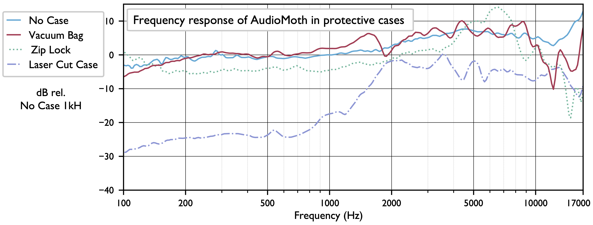
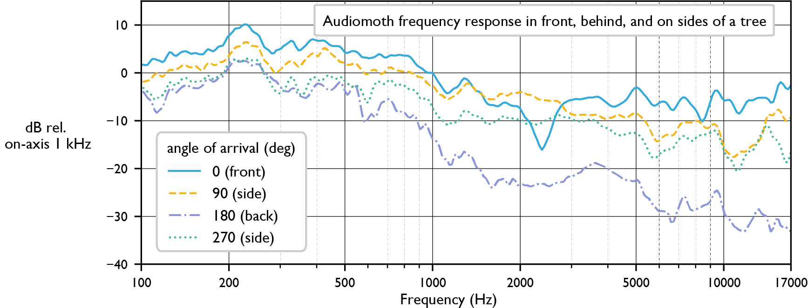

# Summary

The [AudioMoth](https://www.openacousticdevices.info/) acoustic logger
by Open Acoustic Devices has the ability
to capture accurate soundscape recordings, but adding protective
housings and placing them on trees can significantly alter the
sensitivity and frequency response. Pink noise recordings were used to
analyze the frequency-dependent sensitivity of the AudioMoth in four
housings and two environments (open grassland, forest).

The on-axis frequency response of the AudioMoth without a case is mostly
flat, with a 10 dB boost above 3 kHz (blue line in plot below). Of the
four housings tested (Ziplock bag, vacuum seal bag, laser-cut case, Open
Acoustics Devices injection-moulded case),
the bags caused the least change in frequency response. For AudioMoth v1.2.0,
the injection-moulded case increased directionality: sounds arriving from the
front are recorded with higher volume than sounds arriving from other directions.
Compared to the AudioMoth, the Song Meter Micro by Wildlife
Acoustics has a non-flat frequency response but is relatively omnidirectional
despite its protective housing.

In an open environment, with or without housing, high-frequency sounds
(\>10 kHz) arriving from behind the device strongly are attenuated. When
the AudioMoth is deployed by strapping it on a tree, sounds arriving
from behind the device are attenuated by about 10 dB below 1 kHz and 20
dB or more above 1 kHz. Also, a notch filter occurs at a specific
frequency (about 2.3 kHz) when sound arrives from directly in front of
the device.

Protective housings and placement on trees clearly cause significant
reductions of sensitivity to certain frequencies. These effects should
be considered during the deployment of recorders and during the analysis
of recorded audio.
